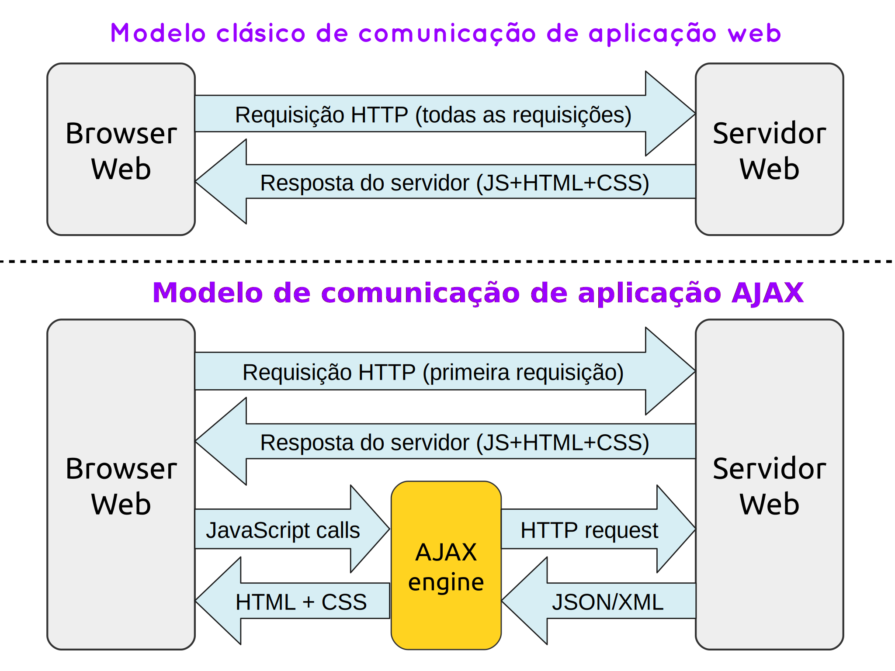

# {{ page.exam-title }}

<div class="pergunta" markdown="1">

1\. Marque a alternativa CORRETA que preenche, respectivamente, as lacunas do texto a seguir.

> O usuário ao acessar uma aplicação web no padrão MVC (Model-View-Controller) recebe como resposta arquivos HTML, CSS e
> JavaScript. O processamento feito no lado servidor para gerar o conteúdo recebido pelo cliente é realizado pela camada
> <u></u> e as orientações para a geração desse conteúdo estão na camada <u></u>.

</div>

| a) ◯ | Model - View            |
| b) ◯ | Model - Controller      |
| c) ◯ | Controller - Controller |
| d) ⬤ | Controller - View       |
| e) ◯ | View - Controller       |
{: .opcoes}

<div class="pergunta" markdown="1">

2\. Observe os itens a seguir a respeito dos conceitos de acesso a banco de dados:

0. O uso do padrão DAO é feito para isolar as características de esquema dos dados do resto do sistema.
0. Os dados acessados pelos métodos DAO sempre estarão em SGBD relacionais.
0. O usuário final se beneficia diretamente quando a aplicação utiliza o padrão DAO.
0. Um driver JDBC contém um ou mais protocolos de rede para acessar um SGBD específico, por exemplo, o driver JDBC do
   MySQL implementa os protocolos para fazer login à base, enviar SQL, etc.
0. Um objeto `ResultSet` do JDBC representa um cursor para as linhas do resultado de uma consulta.
{: .pontos}

Está INCORRETO apenas o que se afirma em:

</div>

| a) ◯ | I e II | b) ⬤ | II e III | c) ◯ | II, III e IV | d) ◯ | III, IV e V | e) ◯ | IV e V |
{: .opcoes-linha}

<div class="pergunta" markdown="1">

3\. Um revisor de código recebeu do programador a implementação da classe `ClienteDao` com os métodos de acesso a dados
dos clientes da empresa. No entanto, ele detectou uma inconsistência: um dos métodos adicionados pelo programador
deveria ser implementado em uma outra classe DAO.

Identifique qual dos métodos não deveria ser da classe `ClienteDao`. Explique a sua resposta.

```java
public class ClienteDao {
    public Cliente obter(int id) { }

    public Cliente obterPorCpf(String cpf) { }

    public List<Cliente> obterTodos() { }

    public List<Cliente> obterPorNome(String nome) { }

    public List<Cliente> obterPorSobrenome(String sobrenome) { }

    public List<Compra> obterCompras(int id) { }

    public boolean adicionar(Cliente cliente) { }

    public boolean modificar(Cliente cliente) { }

    public boolean excluir(int id) { }

    public boolean registrarCompra(int id, Compra compra) { }
}
```

</div>

<div class="resposta" markdown="1">

O método `registrarCompra()` deveria estar em uma classe como `CompraDao` ou algo assim, pois o registro de compras não
deve ser responsabilidade do cliente.

</div>

<div class="pergunta" markdown="1">

4\. AJAX tem por significado _Asynchronous Javascript And XML_ e representa um conceito para descrever a interação de um
objeto específico no lado do cliente com os programas do lado servidor. Conceitualmente, utiliza um objeto baseado em
JavaScript para enviar solicitações ao servidor da Web de forma assíncrona, sem ter que recarregar a página.

Ao empregar esse objeto, os aplicativos Web podem receber/enviar informações ao servidor e fazer com que o servidor
execute qualquer processamento que necessite ser feito, para depois alterar aspectos da página da web dinamicamente sem
que o usuário tenha que mudar de página ou alterar o local de seu foco. Esse objeto é conhecido por:

</div>

| a) ◯ | XMLRequest           |
| b) ◯ | XMLHttpResponse      |
| c) ◯ | XMLHttpReset         |
| d) ⬤ | XMLHttpRequest       |
| e) ◯ | XMLAjaxActiveXObject |
{: .opcoes}

<div class="pergunta" markdown="1">

5\. Em relação aos conceitos de AJAX, observe os itens a seguir:

0. A plataforma do lado cliente tem que ser compatível para as aplicações AJAX funcionarem corretamente.
0. Nas comunicações entre a aplicação AJAX e servidor, o usuário deve aguardar o processamento para iniciar outra
   interação com a aplicação.
0. A troca de dados com o servidor e a exibição da resposta ao usuário são feitas sem recarregar a página web por inteiro.
0. O uso de AJAX torna necessário recarregar a página inteira, impossibilitando que atualizações de partes específicas
   sejam realizadas separadamente.
{: .pontos}

Está CORRETO somente o que se afirma em:

</div>

| a) ◯ | I | b) ◯ | I e II | c) ⬤ | I e III | d) ◯ | II e III | e) ◯ | II e IV |
{: .opcoes-linha}

<div class="pergunta" markdown="1">

6\. Observe a figura a seguir que mostra a diferença entre a interação nas aplicações web tradicionais (clássicas) e
aplicações que utilizam AJAX.

{: width="80%"}

Relacionando com esta figura, utilize o seu conhecimento e explique com pelo menos 30 palavras, a vantagem da utilização
do modelo AJAX em relação ao clássico.

</div>

<div class="resposta" markdown="1">

No modelo clássico, as respostas a todas as requisições envolvem arquivos HTML, CSS e JavaScript.

Com AJAX, esse processo é melhorado com respostas curtas, usando fragmentos de informações, que serão transformados em
HTML e CSS, no lado cliente, após uma primeira resposta completa.

</div>
