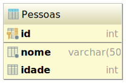
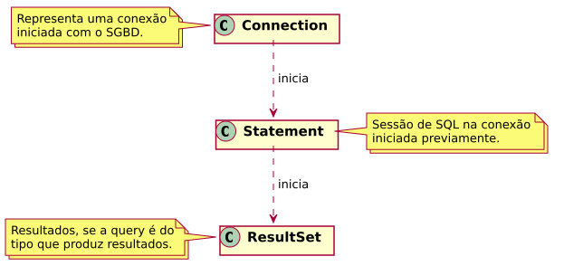
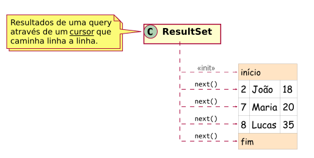

* TOC
{:toc}

# O que é JDBC?

JDBC significa _Java Database Connectivity_ e é uma **API** da plataforma Java para acesso a banco de dados.

O objetivo do JDBC é abstrair o acesso a diferentes sistemas gerenciadores de banco de dados (SGBD) através de um
conjunto de classes e interfaces que formam a API, de forma que o acesso a qualquer SGBD é feito do mesmo modo,
independente do fabricante.

# Driver JDBC

Para acessar o SQL Server (ou qualquer outro SGBD) através da aplicação Java, é preciso usar um **driver&nbsp;JDBC**,
que é uma implementação da API para um SGBD específico.
 
O driver do SQL Server é fornecido pela Microsoft: para baixar, acesse o link
<https://www.microsoft.com/pt-BR/download/details.aspx?id=55539>, depois descompacte em um local de preferência.

## O que um driver JDBC oferece?

Um driver JDBC oferece suporte a:

- realizar conexão ao SGBD;
- enviar comandos SQL para um SGBD conectado;
- fazer a leitura dos resultados, se houver;
- mapeamento de tipos de dados SQL para os tipos de dados da linguagem Java.

# Acessando um banco de dados pelo NetBeans

Antes de vermos mais sobre JDBC, vamos aprender a acessar o banco usando o NetBeans.

Para continuar, crie um _database_ pelo **SQL Management Studio**. Nos exemplos, estarei utilizando um database
chamado `PROGWEB` localizado em uma instância do SQL Server em _localhost_.

Assim, você fará dois passos, primeiro configure o driver JDBC do SQL Server no serviço de banco de dados
do NetBeans. Para isso, você irá usar o arquivo `mssql-jdbc-6.2.1.jre8.jar`, localize-o no local em que você
descompactou o driver e depois siga os passos do screencast a seguir.

<video src="../../assets/screencasts/registrar-driver-jdbc.webm" controls width="90%"></video>

O segundo passo é registrar uma conexão ao _database_. No screencast abaixo é mostrado como fazer isso e como criar uma
tabela na conexão registrada.

<video src="../../assets/screencasts/registrar-conexao-sqlserver.webm" controls width="90%"></video>

Nos exemplos no resto dessa aula, irei utilizar a tabela **Pessoas**:



Essa tabela também pode ser criada usando o script SQL abaixo:

```sql
CREATE TABLE Pessoas (
    id INT PRIMARY KEY,
    nome VARCHAR(50),
    idade INT
);
```

# Usando o JDBC

O funcionamento básico do JDBC é feito através de três classes: `Connection`, `Statement` e `ResultSet`, conforme é
ilustrado na figura abaixo.



Após a autenticação no SGBD, temos uma conexão em que podemos criar sessões para enviar instruções SQL.

Dentro de uma sessão, se escrevermos instruções SQL que produzem resultados, tais como `SELECT`, então poderemos ler os
resultados.

## Biblioteca do driver JDBC

No projeto do NetBeans, adicione como biblioteca do projeto o arquivo `mssql-jdbc-6.2.1.jre8.jar`, que é o mesmo JAR
usado no serviço de banco de dados do NetBeans.

<video src="../../assets/screencasts/adicionar-driver-jdbc.webm" controls width="90%"></video>

## Registro do driver JDBC

Antes de permitir a conexão ao banco, o Java precisa saber da existência do driver JDBC, para isso, utilize o seguinte
trecho de código a seguir:

```java
try {
    Class.forName("com.microsoft.sqlserver.jdbc.SQLServerDriver");
} catch (ClassNotFoundException ex) {
    throw new RuntimeException(ex);
}
```

Esse trecho só precisa ocorrer uma vez e se houver exceção, não será possível conectar ao SQL Server.

## Estabelecendo uma conexão

Para iniciar uma conexão no código Java, você irá usar a classe `DriverManager` passando uma URL de conexão que
representa a conexão ao SGDB utilizado.

No caso do SQL Server, para acessar uma instância em _localhost_ e no database `PROGWEB`, teremos a seguinte URL
de conexão.

```java
String jdbcUrl = "jdbc:sqlserver://localhost;databaseName=PROGWEB;user=sa;password=123456";
```

E para iniciar a conexão, basta o código a seguir. Se ocorrer exceção, isso quer dizer que não foi possível estabelecer
a conexão.

```java
String jdbcUrl = "jdbc:sqlserver://localhost;databaseName=PROGWEB;user=sa;password=123456";
try (Connection conn = DriverManager.getConnection(jdbcUrl)) {
    //
    // Utiliza a conexão para enviar SQL
    //
} catch (SQLException ex) {
    Logger.getLogger(NewClass.class.getName()).log(Level.SEVERE, null, ex);
}
```

## Enviando SQL

O código a seguir faz uso da classe `Statement` para inserir uma linha na tabela **Pessoas**.

```java
// Instrução SQL
String query = "INSERT INTO Pessoas (id, nome, idade) " +
               "VALUES (2, 'João', 18)";

// Inicia sessão na conexão e envia SQL
Statement stmt = conn.createStatement();
stmt.execute(query);
```

## Obtendo resultados

Se enviarmos um `SELECT` como query, poderemos obter um `ResultSet`. Essa classe representa um cursor para as linhas do
resultado recebido. Inicialmente o cursor estará antes da primeira linha e à medida que chamamos chamamos o método
`next()`, obteremos as próximas linhas:



O método `next()` retorna um booleano, enquanto o resultado for _true_, isso quer dizer que o cursor está em uma linha
que pode ser lida.

O trecho de código a seguir ilustra como obter todos os resultados de uma query:

```java
// Query que retorna resultado
String query = "SELECT nome, idade FROM Pessoas";

// Inicia sessão na conexão e envia SQL
Statement stmt = conn.createStatement();
stmt.execute(query);

// Obtém o cursor de resultado
ResultSet rs = stmt.getResultSet();

// Move o cursor até chegar ao fim do resultado
while (rs.next()) {
    // Obtém os valores das colunas na linha atual
    String nome = rs.getString("nome");
    int idade   = rs.getInt("idade");

    // Faz algo com os valores
    System.out.println("nome=" + nome + ", idade=" + idade);
}
```
