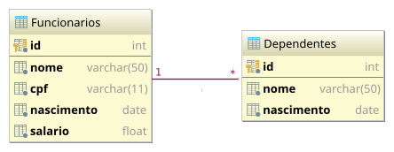

* TOC
{:toc}

# Cenário de exemlo

Vamos criar a camada de acesso a dados para um simples cadastro de funcionários com dependentes, conforme ilustração.



# Tabelas da base de dados

Nesse cenário teremos apenas duas tabelas, **Funcionarios** e **Dependentes** com um relacionamento de um funcionário
para zero ou mais dependentes.

Isto é, eu posso ter um funcionário sem nenhum dependente, com apenas um dependente ou mesmo com 20 dependentes. Mas
cada dependente só poderá ter apenas um funcionário.

---

Assim, sendo, teremos as seguintes tabelas:

```sql
CREATE TABLE Funcionarios (
  id         INT IDENTITY PRIMARY KEY,
  nome       VARCHAR(50) NOT NULL,
  cpf        VARCHAR(11) NOT NULL,
  nascimento DATE        NOT NULL,
  salario    FLOAT       NOT NULL
);

CREATE TABLE Dependentes (
  id             INT IDENTITY PRIMARY KEY,
  nome           VARCHAR(50) NOT NULL,
  nascimento     DATE        NOT NULL,
  funcionario_id INT         NOT NULL REFERENCES Funcionarios(id)
);
```

# Classes de dados

Para poder receber os dados, vamos criar classes [POJO] para cada tabela:

{: data-caption="Funcionario.java"}
```java
package fanese.web.model;

import java.util.Date;

public class Funcionario {
    private int id;
    private String nome;
    private String cpf;
    private Date nascimento;
    private double salario;

    // getters e setters
    ...
}
```

{: data-caption="Dependente.java"}
```java
package fanese.web.model;

import java.util.Date;

public class Dependente {
    private int id;
    private String nome;
    private Date nascimento;
    private int funcionarioId;

    // getters e setters
    ...
}
```

# Classe da fábrica de conexões

As classes DAO não precisam saber de informações de conexão ao SGBD, isto fica na classe de fábrica de conexões.
Note que a classe da fábrica fica no subpacote `dao`:

{: data-caption="Database.java"}
```java
package fanese.web.dao;

import org.sql2o.Sql2o;

public class Database extends Sql2o {

    /**
     * Constantes das informações de conexão ao SGBD
     */
    private static final String
            JDBC_URL = "jdbc:sqlserver://localhost;databaseName=PROGWEB",
            USER = "sa",
            PASSWORD = "123456";

    //<editor-fold desc="Instância única da classe (padrão singleton)">
    private Database() {
        super(JDBC_URL, USER, PASSWORD);
    }

    private static final Database INSTANCE = new Database();

    public static Database getInstance() {
        return INSTANCE;
    }
    //</editor-fold>
}
```

# Classes DAO

Segue abaixo as classes de acesso a dados desse cenário de exemplo.

## FuncionarioDao

```java
package fanese.web.dao;

import fanese.web.model.Dependente;
import fanese.web.model.Funcionario;
import org.sql2o.Connection;

import java.util.List;

public class FuncionarioDao {
    /**
     * Referência da fábrica de conexões
     */
    private static final Database db = Database.getInstance();

    public Funcionario obter(int id) {
        String query =
            "SELECT id, nome, cpf, nascimento, salario " +
            "FROM Funcionarios " +
            "WHERE id = :id";

        try (Connection con = db.open()) {
            return con.createQuery(query)
                .addParameter("id", id)
                .executeAndFetchFirst(Funcionario.class);
        }
    }

    public List<Funcionario> obterTodos() {
        String query =
            "SELECT id, nome, cpf, nascimento, salario " +
            "FROM Funcionarios";

        try (Connection con = db.open()) {
            return con.createQuery(query)
                .executeAndFetch(Funcionario.class);
        }
    }

    public boolean adicionar(Funcionario f) {
        String query =
            "INSERT INTO Funcionarios (nome, cpf, nascimento, salario) " +
            "VALUES (:nome, :cpf, :nascimento, :salario)";

        try (Connection con = db.open()) {
            con.createQuery(query)
                .addParameter("nome", f.getNome())
                .addParameter("cpf", f.getCpf())
                .addParameter("nascimento", f.getNascimento())
                .addParameter("salario", f.getSalario())
                .executeUpdate();

            // Obtém id gerado automaticamente pelo SGBD
            Integer id = con.getKey(Integer.class);
            f.setId(id);

            return con.getResult() > 0;
        }
    }

    public boolean modificar(Funcionario f) {
        String query =
            "UPDATE Funcionarios " +
            "SET nome = :nome, cpf = :cpf, nascimento = :nascimento, salario = :salario " +
            "WHERE id = :id";

        try (Connection con = db.open()) {
            con.createQuery(query)
                .addParameter("id", f.getId())
                .addParameter("nome", f.getNome())
                .addParameter("cpf", f.getCpf())
                .addParameter("nascimento", f.getNascimento())
                .addParameter("salario", f.getSalario())
                .executeUpdate();

            return con.getResult() > 0;
        }
    }

    public boolean excluir(Funcionario f) {
        // Abre transação em vez de conexão normal
        try (Connection con = db.beginTransaction()) {
            // Exclui todos os dependentes do funcionário
            con.createQuery("DELETE Dependentes WHERE funcionario_id = :id")
                .addParameter("id", f.getId())
                .executeUpdate();

            // Depois remove o funcionário
            con.createQuery("DELETE Funcionarios WHERE id = :id")
                .addParameter("id", f.getId())
                .executeUpdate();

            int result = con.getResult();

            // Valida a transação
            con.commit();

            return result > 0;
        }
    }

    public List<Dependente> obterDependentes(Funcionario f) {
        String query =
            "SELECT id, nome, nascimento, funcionario_id " +
            "FROM Dependentes " +
            "WHERE funcionario_id = :id";

        try (Connection con = db.open()) {
            return con.createQuery(query)
                .addParameter("id", f.getId())
                .executeAndFetch(Dependente.class);
        }
    }

    public boolean adicionarDependente(Funcionario f, Dependente dep) {
        // Define o relacionamento
        dep.setFuncionarioId(f.getId());

        // Reaproveita o DAO já existente
        DependenteDao dependenteDao = new DependenteDao();

        return dependenteDao.adicionar(dep);
    }

    public boolean excluirDependente(Funcionario f, Dependente dep) {
        // Verifica o relacionamento
        if (f.getId() != dep.getFuncionarioId()) {
            return false;
        }

        // Reaproveita o DAO já existente
        DependenteDao dependenteDao = new DependenteDao();

        return dependenteDao.excluir(dep);
    }
}
```

## DependenteDao

```java
package fanese.web.dao;

import fanese.web.model.Dependente;
import fanese.web.model.Funcionario;
import org.sql2o.Connection;

import java.util.List;

public class DependenteDao {
    /**
     * Referência da fábrica de conexões
     */
    private static final Database db = Database.getInstance();

    public Dependente obter(int id) {
        String query =
            "SELECT id, nome, nascimento, funcionario_id " +
            "FROM Dependentes " +
            "WHERE id = :id";

        try (Connection con = db.open()) {
            return con.createQuery(query)
                .addParameter("id", id)
                .executeAndFetchFirst(Dependente.class);
        }
    }

    public List<Dependente> obterTodos() {
        String query =
            "SELECT id, nome, nascimento, funcionario_id " +
            "FROM Dependentes";

        try (Connection con = db.open()) {
            return con.createQuery(query)
                .executeAndFetch(Dependente.class);
        }
    }

    public boolean adicionar(Dependente dep) {
        String query =
            "INSERT INTO Dependentes (nome, nascimento, funcionario_id) " +
            "VALUES (:nome, :nascimento, :funcionario_id)";

        try (Connection con = db.open()) {
            con.createQuery(query)
                .addParameter("nome", dep.getNome())
                .addParameter("nascimento", dep.getNascimento())
                .executeUpdate();

            // Obtém id gerado automaticamente pelo SGBD
            Integer id = con.getKey(Integer.class);
            dep.setId(id);

            return con.getResult() > 0;
        }
    }

    public boolean modificar(Dependente dep) {
        String query =
            "UPDATE Dependentes " +
            "SET nome = :nome, nascimento = :nascimento " +
            "WHERE id = :id";

        try (Connection con = db.open()) {
            con.createQuery(query)
                .addParameter("id", dep.getId())
                .addParameter("nome", dep.getNome())
                .addParameter("nascimento", dep.getNascimento())
                .executeUpdate();

            return con.getResult() > 0;
        }
    }

    public boolean excluir(Dependente dep) {
        String query =
            "DELETE Dependentes WHERE id = :id";

        try (Connection con = db.open()) {
            con.createQuery(query)
                .addParameter("id", dep.getId())
                .executeUpdate();

            return con.getResult() > 0;
        }
    }

    public Funcionario obterFuncionario(Dependente dep) {
        // Reaproveita o DAO já existente
        FuncionarioDao funcionarioDao = new FuncionarioDao();

        return funcionarioDao.obter(dep.getFuncionarioId());
    }
}
```

[POJO]: https://pt.wikipedia.org/wiki/Plain_Old_Java_Objects
{: target="_blank"} 
