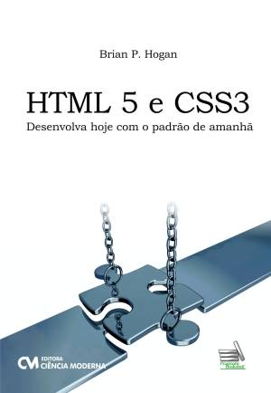

* TOC
{:toc}

# Introdução

Um formulário web é uma seção do documento HTML usada para coletar dados do usuário.

Os dados são preenchidos no  **lado&nbsp;cliente**, isto é, no _browser_, e são enviados para serem processados no **lado&nbsp;servidor**.

## Exemplo de formulário


<form>
  Nome: <br>
  <input type="text" name="nome"><br>
  Sobrenome: <br>
  <input type="text" name="sobrenome"><br>
  <br>
  <input type="submit">
</form>


```html
{{ snippet }}
```

{: .exemplo}
{{ snippet }}

## O elemento &lt;form&gt;

Este elemento HTML define uma seção de formulário.

```html
<form>
  ...
  elementos de formulário
  ...
</form>
```

Um formulário contém elementos de formulário, que são os campos a serem preenchidos pelo usuário.

## Validação

Validar um formulário é a verificação dos dados digitados pelo usuário.

HTML5 fornece recursos poderosos para a validação no lado cliente, que só eram possíveis nas versões anteriores usando JavaScript.

É muito importante que a validação também seja **replicada** no lado servidor:

- O browser do cliente pode _não suportar_ validação.
- O usuário pode _desabilitar_ JavaScript.
- O usuário pode não estar usando um browser.

Seja qual for o motivo, o lado servidor deve também estar protegido contra dados **inválidos**, **fraudulentos** ou **maliciosos**, em geral.

# Elementos de formulário

## &lt;input&gt;

O elemento `<input>` é o mais importante elemento de formulário. O atributo `type` define a forma desse elemento.

### &lt;input type="text"&gt;


Nome: <input type="text" name="nm">


```html
{{ snippet }}
```

{: .exemplo}
{{ snippet }}

### &lt;input type="submit"&gt;

O botão de enviar (submeter) os dados preenchidos para o servidor.


Nome: <input type="text" name="nm">
<input type="submit">


```html
{{ snippet }}
```

{: .exemplo}
<form>
  {{ snippet }}
</form>

### &lt;input type="password"&gt;


Código secreto: <input type="password" name="sc">


```html
{{ snippet }}
```

{: .exemplo}
{{ snippet }}

### &lt;input type="radio"&gt;


Qual a sua preferência? <br>
<input type="radio" value="1" name="pref"> Livros <br>
<input type="radio" value="2" name="pref"> Filmes


```html
{{ snippet }}
```

{: .exemplo}
{{ snippet }}

### &lt;input type="checkbox"&gt;


Do que você gosta? <br>
<input type="checkbox" value="a" name="gosto"> Teatro <br>
<input type="checkbox" value="b" name="gosto"> Literatura <br>
<input type="checkbox" value="c" name="gosto"> Cinema <br>
<input type="checkbox" value="d" name="gosto"> TV


```html
{{ snippet }}
```

{: .exemplo}
{{ snippet }}

### &lt;input type="reset"&gt;


Nome: <input type="text" name="nome"><br>
Senha: <input type="password" name="senha"><br>
Qual a sua preferência?
<input type="radio" value="1" name="pref"> Livros
<input type="radio" value="2" name="pref"> Filmes
<br><br>
<input type="reset">


```html
{{ snippet }}
```

{: .exemplo}
<form>
  {{ snippet }}
</form>

### &lt;input type="file"&gt;


<input type="file" name="perfil">


```html
{{ snippet }}
```

{: .exemplo}
{{ snippet }}

### &lt;input type="hidden"&gt;


<input type="hidden" name="escolha" value="c">


```html
{{ snippet }}
```

{: .exemplo}
Aqui tem um _input_ oculto.
{{ snippet }}

### &lt;input type="button"&gt;


<!-- Deve ser usado com JavaScript -->
Nome de usuário: <input type="text" name="nm">
<input type="button" value="Checar"
       onclick="alert('Usuário disponível para cadastro')">


```html
{{ snippet }}
```

{: .exemplo}
<form>
  {{ snippet }}
</form>

### &lt;input type="search"&gt;


Busca: <input type="search" name="q">


```html
{{ snippet }}
```

{: .exemplo}
{{ snippet }}

### &lt;input type="tel"&gt;


Entre um telefone no formato <b>(xx) xxxx-xxxx</b> <br>
<input type="tel" pattern="\([0-9]{2}\)[\s][0-9]{4}-[0-9]{4}" name="fone">


```html
{{ snippet }}
```

{: .exemplo}
<form>
  {{ snippet }}
</form>

### &lt;input type="email"&gt;


Digite seu e-mail: <input type="email" name="email">


```html
{{ snippet }}
```

{: .exemplo}
<form>
  {{ snippet }}
</form>

### &lt;input type="url"&gt;


Página pessoal: <input type="url" name="homepage">


```html
{{ snippet }}
```

{: .exemplo}
<form>
  {{ snippet }}
</form>

### &lt;input type="number"&gt;


Idade: <input type="number" name="idade">


```html
{{ snippet }}
```

{: .exemplo}
<form>
  {{ snippet }}
</form>

### &lt;input type="range"&gt;


Grau de satisfação: <br>
<input type="range" name="satisfacao">


```html
{{ snippet }}
```

{: .exemplo}
{{ snippet }}


<!-- Mostrando o número do range (com JavaScript) -->
Grau de satisfação: <output name="mostraGrau">0</output><br>
<input type="range" name="satisfacao" value="0"
       oninput="mostraGrau.value = this.value">


```html
{{ snippet }}
```

{: .exemplo}
<form>
  {{ snippet }}
</form>

### &lt;input type="color"&gt;


Qual a sua cor favorita?
<input type="color" name="corFav">


```html
{{ snippet }}
```

{: .exemplo}
{{ snippet }}

### &lt;input type="date"&gt;


Data de nascimento:
<input type="date" name="nascimento">


```html
{{ snippet }}
```

{: .exemplo}
{{ snippet }}

### &lt;input type="time"&gt;


Qual hora você acorda? 
<input type="time" name="horario">


```html
{{ snippet }}
```

{: .exemplo}
{{ snippet }}

### &lt;input type="datetime-local"&gt;


Data e hora da ocorrência: 
<input type="datetime-local" name="ocorrencia">


```html
{{ snippet }}
```

{: .exemplo}
{{ snippet }}

### &lt;input type="month"&gt;


Mês do seu nascimento:
<input type="month" name="mesNascimento">


```html
{{ snippet }}
```

{: .exemplo}
{{ snippet }}

### &lt;input type="week"&gt;


Nascimento previsto:
<input type="week" name="semanaNascimento">


```html
{{ snippet }}
```

{: .exemplo}
{{ snippet }}

## &lt;select&gt;

Elemento que exibe uma lista de seleção em cascata.


<select name="carros">
  <option value="volvo">Volvo</option>
  <option value="saab">Saab</option>
  <option value="fiat">Fiat</option>
  <option value="audi">Audi</option>
</select>


```html
{{ snippet }}
```

{: .exemplo}
{{ snippet }}

O elemento `<option>` pode receber o atributo `selected`, que faz a opção ser pre-selecionada.


<select name="carros">
  <option value="volvo">Volvo</option>
  <option value="saab">Saab</option>
  <option value="fiat" selected>Fiat</option>
  <option value="audi">Audi</option>
</select>


```html
{{ snippet }}
```

{: .exemplo}
{{ snippet }}

## &lt;textarea&gt;


<textarea name="mensagem" rows="5" cols="30">
O gato estava brincando no Jardim
</textarea>


```html
{{ snippet }}
```

{: .exemplo}
<div>
  {{ snippet }}
</div>

## &lt;datalist&gt;


Browser preferido: <br>
<input list="browsers" name="browser">
<datalist id="browsers">
  <option value="Internet Explorer">IE</option>
  <option value="Firefox">Fx</option>
  <option value="Chrome">GC</option>
  <option value="Opera">O</option>
  <option value="Safari">Sf</option>
</datalist> 


```html
{{ snippet }}
```

{: .exemplo}
{{ snippet }}

## &lt;button&gt;

Este elemento tem o mesmo efeito de [`<input type="submit">`](#input-typesubmit), [`<input type="reset">`](#input-typereset) ou [`<input type="button">`](#input-typebutton), mas leva a semântica do tipo do elemento e é mais flexível


Nome: <input type="text" name="nome"><br>
Senha: <input type="password" name="senha"><br>
Qual a sua preferência?
<input type="radio" value="1" name="pref"> Livros
<input type="radio" value="2" name="pref"> Filmes
<br><br>
<button type="submit">Cadastrar</button>
<button type="reset">Limpar</button>
<button type="button" onclick="alert('Checado...')">Checar</button>


```html
{{ snippet }}
```

{: .exemplo}
<form>
  {{ snippet }}
</form>

# Enviando os dados

No momento em que o usuário clica em enviar os dados de um formulário, o browser formata a requisição HTTP, adicionando os dados preenchidos pelo usuário num formato conhecido como _**query string**_.

## Query string 

A _query string_ é criada a partir de todos os elementos do formulário que contém um atributo `name`.

O formulário abaixo irá gerar a seguinte query string: `nome=Alan&sobrenome=Moore`.


<form>
  Nome: <br>
  <input type="text" name="nome" value="Alan" readonly><br>
  Sobrenome: <br>
  <input type="text" name="sobrenome" value="Moore" readonly><br>
  <br>
  <input type="submit">
</form>


```html
{{ snippet | remove: " readonly" }}
```

{: .exemplo}
{{ snippet }}

### Caractere separador

O caractere `&` é utilizado para separar cada `nome=valor` enviado.

### Ordem dos nomes na query string

A ordem dos elementos dispostos no formulário é utilizado pelo browser ao criar a query string. No exemplo anterior, se o campo de sobrenome viesse antes do nome, a ordem seria invertida e teríamos o seguinte:

```
sobrenome=Moore&nome=Alan
```

### Valores múltiplos

Elementos como `checkbox` precisam enviar vários valores.

Com o formulário abaixo, teremos a query string `quem=Zezinho&gosto=a&gosto=c&gosto=d`.


<form>
  Nome: <input type="text" name="quem" value="Zezinho" readonly><br>
  Do que você gosta? <br>
  <input type="checkbox" value="a" name="gosto" checked onclick='return false'> Teatro <br>
  <input type="checkbox" value="b" name="gosto" onclick='return false'> Literatura     <br>
  <input type="checkbox" value="c" name="gosto" checked onclick='return false'> Cinema <br>
  <input type="checkbox" value="d" name="gosto" checked onclick='return false'> TV     <br>
  <br>
  <input type="submit">
</form>


```html
{{ snippet | remove: " readonly" | remove: " onclick='return false'" }}
```

{: .exemplo}
{{ snippet }}

### Codificação

A query string tem uma limitação nos caracteres aceitos, por exemplo, não são aceitos espaços em branco e caracteres acentuados, que são substituídos pelo browser, quando enviados, por valores especiais.

O formulário abaixo gera a query string `justificativa=O+tr%C3%A2nsito+me+atrasou` 


<form>
  Justificativa: <br>
  <input type="text" name="justificativa"
         value="O trânsito me atrasou" readonly>
   <br>
  <input type="submit">
</form>

 
```html
{{ snippet | remove: " readonly" }}
```

{: .exemplo}
{{ snippet }}

# Atributos do formulário

## O atributo action

O elemento `<form>` pode receber o atributo `action`, o qual define qual URL (ação) receberá os dados do formulário.

O formulário abaixo envia os dados para <http://httpbin.org/anything>.


<form action="http://httpbin.org/anything">
  Nome: <input type="text" name="meunome">
  <input type="submit">
</form>


```html
{{ snippet }}
```

{: .exemplo}
{{ snippet }}

---

Se o atributo `action` for omitido ou estiver vazio, os dados são enviados para a página atual.


<form>
  Nome: <input type="text" name="meunome">
  <input type="submit">
</form>


```html
{{ snippet }}
```

{: .exemplo}
{{ snippet }}

## O atributo method

O atributo `method` define qual método HTTP será usado (GET ou POST) para enviar os dados do formulário. Quando não definido, o padrão é GET.

```html
<form action="/pagina.jsp" method="get">
```

ou

```html
<form action="/pagina.jsp" method="post">
```

# Métodos de envio
 
## Método GET

Quando o formulário é enviado por método GET, a query string fica visível na URL:



```
http://prof.wagnermacedo.com{{ page.url }}?{{ queryString }}
```

O caractere `?` é utilizado para separar o caminho da query string.

```http
GET {{ page.url }}?{{ queryString }} HTTP/1.1
Host: prof.wagnermacedo.com

```

## Método POST

O método POST deve ser utilizado quando dados sensíveis, como senha ou número de cartão de crédito, são enviados.

Usando o método POST, a query string é enviada no corpo da requisição.

```http
POST {{ page.url }} HTTP/1.1
Host: prof.wagnermacedo.com
Content-Type: application/x-www-form-urlencoded
Content-Length: 38

nome=Peter+Pan&endereco=Terra+do+Nunca
```

### Exemplos


<form action="http://httpbin.org/anything" method="post">
  Nome: <br>
  <input type="text" name="nome"><br>
  Sobrenome: <br>
  <input type="text" name="sobrenome"><br>
  <br>
  <input type="submit">
</form>


```html
{{ snippet }}
```

{: .exemplo}
{{ snippet }}

---

Quando usando POST, é possível enviar dados tanto na URL quando no corpo da requisição.


<form action="http://httpbin.org/anything?assunto=m%C3%A9todo+post" method="post">
  Nome: <br>
  <input type="text" name="nome"><br>
  Sobrenome: <br>
  <input type="text" name="sobrenome"><br>
  <br>
  <input type="submit">
</form>


```html
{{ snippet }}
```

{: .exemplo}
{{ snippet }}

## Idempotência

O método GET é especificado como [idempotente](https://www.priberam.pt/dlpo/idempot%C3%AAncia), isto é, quando uma página é chamada mais de uma vez, não haverá efeitos colaterais.

O browser pode tentar acessar uma mesma página mais de uma vez, caso encontre dificuldades no acesso. Se isso ocorrer em uma página de cadastro, por exemplo, poderá haver dois cadastros feitos com o mesmo nome.

Quando o método é POST, o browser não tenta refazer a requisição.

<!--
  Em @Coulouris2013sistemas [p. 193], é mencionado sobre a idempotência do
  método GET e é falado da requisição ser repetida pelo browser.
-->

# Envio de arquivos

Um formulário pode enviar arquivos, mas apenas se usar o método POST e definir o atributo `enctype="multipart/form-data"`.


<form method="post" enctype="multipart/form-data" action="http://httpbin.org/anything">
  Escolha arquivo: <input type="file" name="arquivo">
  <input type="submit">
</form>


```html
{{ snippet }}
```

{: .exemplo}
{{ snippet }}

# Leitura recomendada

## Sites

- [HTML Forms (https://www.w3schools.com/html/html_forms.asp)](https://www.w3schools.com/html/html_forms.asp)

## Livros

**Capítulo 6**
 
{: width="200" style="border: 1px solid"}

**Capítulo 3**
 
{: width="200" style="border: 1px solid"}
