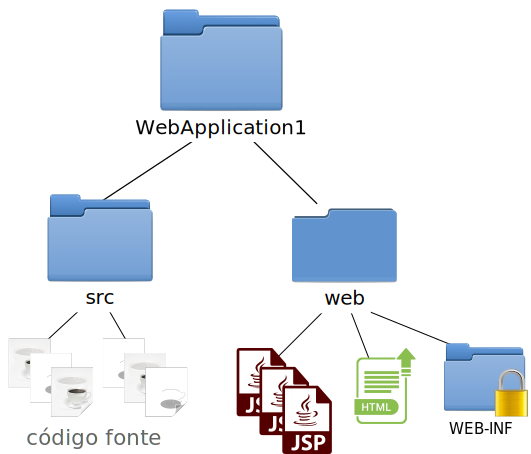
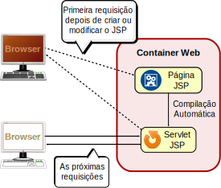

* TOC
{:toc}

# Introdução

O objetivo principal de JSP é escrever facilmente HTML junto ao conteúdo dinâmico do lado servidor.

Em vez de usar trechos de código como

```java
out.println("<p>" + variavel + "</p>");
```

escrevemos algo mais amigável

<div class="highlighter-rouge"><pre class="highlight"><span></span><span class="nt">&lt;p&gt;</span><span class="k">&lt;%=</span> <span class="n">variavel</span> <span class="k">%&gt;</span><span class="nt">&lt;/p&gt;</span>
</pre></div>

## Arquivo JSP

{: data-caption="lado servidor"}
<div class="highlighter-rouge"><pre class="highlight"><span></span><span class="k">&lt;%@</span> <span class="n">page</span> <span class="n">language</span><span class="o">=</span><span class="s">&quot;java&quot;</span> <span class="n">contentType</span><span class="o">=</span><span class="s">&quot;text/html&quot;</span>
         <span class="n">pageEncoding</span><span class="o">=</span><span class="s">&quot;UTF-8&quot;</span>
         <span class="n">import</span><span class="o">=</span><span class="s">&quot;java.util.Date&quot;</span> <span class="k">%&gt;</span>
<span class="nt">&lt;html&gt;</span>
<span class="nt">&lt;head&gt;</span>
    <span class="nt">&lt;title&gt;</span>Página Legal<span class="nt">&lt;/title&gt;</span>
<span class="nt">&lt;/head&gt;</span>
<span class="nt">&lt;body&gt;</span>
    <span class="nt">&lt;p&gt;</span>Hoje é <span class="k">&lt;%=</span> <span class="k">new</span> <span class="n">Date</span><span class="o">()</span> <span class="k">%&gt;</span><span class="nt">&lt;/p&gt;</span>
<span class="nt">&lt;/body&gt;</span>
<span class="nt">&lt;/html&gt;</span>
</pre></div>

{: data-caption="lado cliente"}
```html
<html>
<head>
    <title>Página Legal</title>
</head>
<body>
    <p>Hoje é Mon Aug 28 10:58:56 BRT 2017</p>
</body>
</html>
```

## Usando arquivos JSP

Arquivos JSP são criados na pasta de conteúdo web com a extensão **.jsp**.

### Projeto de aplicação web no NetBeans



## Compilação do arquivo JSP

O arquivo JSP, na verdade, é um _servlet_, mas a compilação é feita automaticamente pelo container.

{:width="70%"} 

# Scriptlet

Os arquivos JSP permitem a introdução de código Java em um ambiente chamado _scriptlet_.

{: data-caption="lado servidor"}
<div class="highlighter-rouge"><pre class="highlight"><span></span><span class="nt">&lt;h1&gt;</span>Exemplo de Scriptlet<span class="nt">&lt;/h1&gt;</span>

<span class="k">&lt;%</span>
    <span class="n">String</span><span class="o">[]</span> <span class="n">lista</span> <span class="o">=</span> <span class="n">request</span><span class="o">.</span><span class="na">getParameterValues</span><span class="o">(</span><span class="s">&quot;lista&quot;</span><span class="o">);</span>
<!---->
    <span class="kt">boolean</span> <span class="n">achou</span> <span class="o">=</span> <span class="kc">false</span><span class="o">;</span>
    <span class="k">for</span> <span class="o">(</span><span class="kt">int</span> <span class="n">i</span> <span class="o">=</span> <span class="mi">0</span><span class="o">;</span> <span class="n">i</span> <span class="o">&lt;</span> <span class="n">lista</span><span class="o">.</span><span class="na">length</span><span class="o">;</span> <span class="n">i</span><span class="o">++)</span> <span class="o">{</span>    
        <span class="k">if</span> <span class="o">(</span><span class="s">&quot;nome&quot;</span><span class="o">.</span><span class="na">equals</span><span class="o">(</span><span class="n">lista</span><span class="o">[</span><span class="n">i</span><span class="o">]))</span> <span class="o">{</span>
            <span class="n">achou</span> <span class="o">=</span> <span class="kc">true</span><span class="o">;</span>
            <span class="k">break</span><span class="o">;</span>
        <span class="o">}</span>
    <span class="o">}</span>
<span class="k">%&gt;</span>

<span class="nt">&lt;p&gt;</span>Resultado da busca: <span class="k">&lt;%=</span> <span class="n">achou</span> <span class="k">%&gt;</span><span class="nt">&lt;/p&gt;</span>
</pre></div>

{: data-caption="lado cliente"}
```html
<h1>Exemplo de Scriptlet</h1>


<p>Resultado da busca: true</p>
```

## Expressões scriptlets

Uma expressão _scriptlet_ consiste em escrever na resposta o valor de uma variável ou expressão Java. 

O exemplo abaixo escreve o conteúdo da variável achou.

<div class="highlighter-rouge"><pre class="highlight">
<span class="k">&lt;%=</span> <span class="n">achou</span> <span class="k">%&gt;</span>
</pre></div>

## Variáveis implícitas

Dentro do ambiente _scriptlet_, algumas variáveis vem previamente declaradas automaticamente:

<div class="highlighter-rouge"><pre class="highlight"><span></span><span class="k">&lt;%</span>
    <span class="n">String</span> <span class="n">nome</span> <span class="o">=</span> <span class="n"><mark>request</mark></span><span class="o">.</span><span class="na">getParameter</span><span class="o">(</span><span class="s">&quot;nome&quot;</span><span class="o">);</span>
<!---->
    <span class="k">if</span> <span class="o">(</span><span class="n">nome</span> <span class="o">!=</span> <span class="kc">null</span><span class="o">)</span> <span class="o">{</span>
        <span class="n"><mark>out</mark></span><span class="o">.</span><span class="na">print</span><span class="o">(</span><span class="s">&quot;A requisição contém o parâmetro &#39;nome&#39;&quot;</span><span class="o">);</span>
    <span class="o">}</span>
<span class="k">%&gt;</span>
</pre></div>

### Lista das principais variáveis implícitas

| Variável      | Descrição                                                 |
|---------------+-----------------------------------------------------------|
| `request`     | Objeto com os dados da requisição do cliente.             |
| `response`    | Objeto para escrever informações da resposta do servidor. |
| `out`         | Similar ao objeto obtido por `response.getWriter()`.      |
| `session`     | Informações da sessão do usuário.                         |
| `config`      | Informações de configuração da aplicação web.             |
| `application` | Informações da aplicação web.                             |
| `pageContext` | Informações da página atual.                              |

# Comentários em arquivos JSP

<div class="highlighter-rouge"><pre class="highlight"><span></span><span class="k">&lt;%-</span><span class="o">-</span> <span class="n">Isto</span> <span class="n">é</span> <span class="n">um</span> <span class="n">comentário</span> <span class="n">JSP</span> <span class="o">--</span><span class="k">%&gt;</span>
<span class="c">&lt;!--</span>
<span class="c">    A diferença para os comentários HTML é que os</span>
<span class="c">    comentários JSP não aparecem no lado cliente</span>
<span class="c">--&gt;</span>
</pre></div>

# Diretiva page

Esta diretiva permite definir informações da página ao gerar a resposta para ser enviada ao cliente.

Além disso, serve para fazer a importação de classes Java a serem usadas na página. 

<div class="highlighter-rouge"><pre class="highlight"><span></span><span class="k">&lt;%@</span> <span class="n">page</span> <span class="n">language</span><span class="o">=</span><span class="s">&quot;java&quot;</span> <span class="n">contentType</span><span class="o">=</span><span class="s">&quot;text/html&quot;</span>
         <span class="n">pageEncoding</span><span class="o">=</span><span class="s">&quot;UTF-8&quot;</span>
         <span class="n">import</span><span class="o">=</span><span class="s">&quot;java.util.Date&quot;</span> <span class="k">%&gt;</span>
</pre></div>


# Diretiva include

A diretiva _include_ permite incluir o conteúdo de outros arquivos na saída do JSP.

A inclusão do arquivo ocorre **somente** no momento da compilação do arquivo JSP.

{: data-caption="/cabecalho.html"}
```html
<header>
  <h1>Página Legal</h1>
</header>
```

{: data-caption="/rodape.html"}
```html
<footer>
  <p>Copyright © do Autor</p>
</footer>
```

{: data-caption="/usandoInclude.jsp (lado servidor)"}
<div class="highlighter-rouge"><pre class="highlight"><span></span><span class="k">&lt;%@</span> <span class="n">page</span> <span class="n">language</span><span class="o">=</span><span class="s">&quot;java&quot;</span> <span class="n">contentType</span><span class="o">=</span><span class="s">&quot;text/html&quot;</span>
         <span class="n">pageEncoding</span><span class="o">=</span><span class="s">&quot;UTF-8&quot;</span> <span class="k">%&gt;</span>

<span class="nt">&lt;html&gt;</span>
<span class="nt">&lt;head&gt;</span>
    <span class="nt">&lt;title&gt;</span>Usando a diretiva include<span class="nt">&lt;/title&gt;</span>
<span class="nt">&lt;/head&gt;</span>
<span class="nt">&lt;body&gt;</span>
    <span class="k">&lt;%@</span> <span class="n">include</span> <span class="n">file</span><span class="o">=</span><span class="s">&quot;cabecalho.html&quot;</span> <span class="k">%&gt;</span>
    <span class="nt">&lt;p&gt;</span>Esse é o conteúdo da página<span class="nt">&lt;/p&gt;</span>
    <span class="k">&lt;%@</span> <span class="n">include</span> <span class="n">file</span><span class="o">=</span><span class="s">&quot;rodape.html&quot;</span> <span class="k">%&gt;</span>
<span class="nt">&lt;/body&gt;</span>
<span class="nt">&lt;/html&gt;</span>
</pre></div>

{: data-caption="/usandoInclude.jsp (lado cliente)"}
```html
<html>
<head>
    <title>Usando a diretiva include</title>
</head>
<body>
    <header>
      <h1>Página Legal</h1>
    </header>
    <p>Esse é o conteúdo da página</p>
    <footer>
      <p>Copyright © do Autor</p>
    </footer>
</body>
</html>
```


# JavaBeans

JavaBeans são classes sem construtor ou possui ao menos um construtor sem argumentos.

Usamos um ou mais JavaBeans no JSP para reduzir a quantidade de código _scriptlet_
e ter uma descrição dos dados usados na página.

{: data-caption="MeuPrimeiroBean.java"}
```java
package meupacote;

public class MeuPrimeiroBean {
    private String mensagem = "Bem vindo";

    public String getMensagem() {
        return mensagem;
    }

    public void setMensagem(String mensagem) {
        this.mensagem = mensagem;
    }
}
```

{: data-caption="usando-bean.jsp (lado servidor)"}
<div class="highlighter-rouge"><pre class="highlight"><span></span><span class="k">&lt;%@</span> <span class="n">page</span> <span class="n">language</span><span class="o">=</span><span class="s">&quot;java&quot;</span> <span class="n">contentType</span><span class="o">=</span><span class="s">&quot;text/html;charset=UTF-8&quot;</span> <span class="k">%&gt;</span>
<span class="cp">&lt;!DOCTYPE html&gt;</span>
<span class="nt">&lt;html&gt;</span>
<span class="nt">&lt;body&gt;</span>
  <span class="k">&lt;jsp:useBean id=&quot;primeirobean&quot; class=&quot;meupacote.MeuPrimeiroBean&quot;/&gt;</span>
  <span class="nt">&lt;p&gt;</span>
    A mensagem atual é
    <span class="nt">&lt;strong&gt;</span><span class="k">&lt;jsp:getProperty name=&quot;primeirobean&quot; property=&quot;mensagem&quot;/&gt;</span><span class="nt">&lt;/strong&gt;</span><span class="nt">&lt;/p&gt;</span>

  <span class="k">&lt;jsp:setProperty name=&quot;primeirobean&quot; property=&quot;mensagem&quot; value=&quot;JavaBean &eacute; legal&quot;/&gt;</span>
  <span class="nt">&lt;p&gt;</span>
    A mensagem depois de adicionada é
    <span class="nt">&lt;strong&gt;</span><span class="k">&lt;jsp:getProperty name=&quot;primeirobean&quot; property=&quot;mensagem&quot;/&gt;</span><span class="nt">&lt;/strong&gt;</span><span class="nt">&lt;/p&gt;</span>
<span class="nt">&lt;/body&gt;</span>
<span class="nt">&lt;/html&gt;</span>
</pre></div>

{: data-caption="usando-bean.jsp (lado cliente)"}
```html
<!DOCTYPE html>
<html>
<body>
  <p>
    A mensagem atual é
    <strong>Bem vindo</strong></p>
  
  <p>
    A mensagem depois de adicionada é
    <strong>JavaBean é legal</strong></p>
</body>
</html>
```

# Expression Language (EL)

Forma de trabalhar com _beans_ de forma mais simplificada.

{: data-caption="lado servidor"}
```smarty
<jsp:useBean id="primeirobean" class="meupacote.MeuPrimeiroBean"/>
A mensagem atual é ${primeirobean.mensagem}
```

{: data-caption="lado cliente"}
```html
A mensagem atual é Bem vindo
```

## Constantes

{: data-caption="lado servidor"}
```smarty
Booleanos: ${true} ou ${false}
Strings: ${"Seja bem vindo!"}
Inteiros: ${102}
Reais: ${34.17}
Nulo: ${null}
```

{: data-caption="lado cliente"}
```html
Booleanos: true ou false
Strings: Seja bem vindo!
Inteiros: 102
Reais: 34.17
Nulo: 
```

## Expressões

{: data-caption="lado servidor"}
```smarty
Booleanas: ${7 + 3 == 10}
Numéricas: ${102 * 2} e ${34.17 + 3}
```

{: data-caption="lado cliente"}
```html
Booleanas: true
Numéricas: 204 e 37.17
```

### Expressões Facilitadoras

Alguns recursos estão disponíveis diretamente com o uso da _Expression Language_.

```smarty
${param['nome']}          <!-- valor de parâmetro  -->
${paramValues['valor']}   <!-- array de parâmetros -->
${cookie['acesso']}       <!-- valor de cookie     -->
${header['User-Agent']}   <!-- valor de cabeçalho  -->
```

# JavaServer Pages Standard Tag Library (JSTL)

A programação JSP é muito mais suave utilizando a biblioteca JSTL.

## Instalação da biblioteca

Antes de usar o JSTL, é preciso ter a biblioteca.

Com a IDE NetBeans, este é um simples passo.

<video src="../../assets/screencasts/adicionar-jstl.webm" controls width="100%"></video>

## Utilizando a biblioteca

JSTL, na verdade, é uma coleção de bibliotecas.

{: data-caption="core"}
<div class="highlighter-rouge"><pre class="highlight">
<span></span><span class="k">&lt;%@</span> <span class="n">taglib</span> <span class="n">uri</span><span class="o">=</span><span class="s">&quot;http://java.sun.com/jsp/jstl/core&quot;</span> <span class="n">prefix</span><span class="o">=</span><span class="s">&quot;c&quot;</span><span class="k">%&gt;</span>
</pre></div>

{: data-caption="fmt"}
<div class="highlighter-rouge"><pre class="highlight">
<span class="k">&lt;%@</span> <span class="n">taglib</span> <span class="n">uri</span><span class="o">=</span><span class="s">&quot;http://java.sun.com/jsp/jstl/fmt&quot;</span> <span class="n">prefix</span><span class="o">=</span><span class="s">&quot;fmt&quot;</span><span class="k">%&gt;</span>
</pre></div>

{: data-caption="sql"}
<div class="highlighter-rouge"><pre class="highlight">
<span class="k">&lt;%@</span> <span class="n">taglib</span> <span class="n">uri</span><span class="o">=</span><span class="s">&quot;http://java.sun.com/jsp/jstl/sql&quot;</span> <span class="n">prefix</span><span class="o">=</span><span class="s">&quot;sql&quot;</span><span class="k">%&gt;</span>
</pre></div>

## Exemplos de uso

### Criação de variáveis &lt;c:set&gt; e saída segura &lt;c:out&gt;

{: data-caption="lado servidor"}
```smarty
<c:set var="email" value="${param['email']}"/>

Seu e-mail é <b><c:out value="${email}"/></b>
```

Se o cliente requisitar com a query string `email=joao@exemplo.com`, receberá:

{: data-caption="lado cliente"}
```html
Seu e-mail é <b>joao@exemplo.com</b>
```

### Remoção de variáveis &lt;c:remove&gt;, condicional com &lt;c:if&gt; e &lt;c:choose&gt;

{: data-caption="lado servidor"}
<div class="highlighter-rouge"><pre class="highlight"><span class="nt">&lt;c:if</span> <span class="na">test=</span><span class="s">"$</span><span class="k">{</span><span class="na">param</span><span class="o">[</span><span class="s1">'nome'</span><span class="o">]</span> <span class="o">!=</span> <span class="kc">null</span><span class="k">}</span><span class="s">"</span><span class="nt">&gt;</span>
    <span class="nt">&lt;c:set</span> <span class="na">var=</span><span class="s">"nome"</span> <span class="na">value=</span><span class="s">"$</span><span class="k">{</span><span class="na">param</span><span class="o">[</span><span class="s1">'nome'</span><span class="o">]</span><span class="k">}</span><span class="s">"</span><span class="nt">/&gt;</span>
    Seu nome é: <span class="nt">&lt;c:out</span> <span class="na">value=</span><span class="s">"$</span><span class="k">{</span><span class="na">nome</span><span class="k">}</span><span class="s">"</span><span class="nt">/&gt;</span>
<span class="nt">&lt;/c:if&gt;</span>

<span class="nt">&lt;c:remove</span> <span class="na">var=</span><span class="s">"nome"</span><span class="nt">/&gt;</span>

<span class="nt">&lt;c:choose&gt;</span>
    <span class="nt">&lt;c:when</span> <span class="na">test=</span><span class="s">"$</span><span class="k">{</span><span class="na">nome</span><span class="k">}</span><span class="s"> != null"</span><span class="nt">&gt;</span>
        A variável <span class="ni">&amp;dollar;</span>{nome} contém o valor $<span class="k">{</span><span class="na">nome</span><span class="k">}</span>
    <span class="nt">&lt;/c:when&gt;</span>
    <span class="nt">&lt;c:otherwise&gt;</span>
        A variável <span class="ni">&amp;dollar;</span>{nome} foi removida
    <span class="nt">&lt;/c:otherwise&gt;</span>
<span class="nt">&lt;/c:choose&gt;</span>

<span class="nt">&lt;form</span> <span class="na">action=</span><span class="s">"$</span><span class="k">{</span><span class="na">pageContext</span><span class="o">.</span><span class="na">request</span><span class="o">.</span><span class="na">requestURI</span><span class="k">}</span><span class="s">"</span> <span class="na">method=</span><span class="s">"post"</span><span class="nt">&gt;</span>
    Nome: <span class="nt">&lt;input</span> <span class="na">type=</span><span class="s">"text"</span> <span class="na">name=</span><span class="s">"nome"</span><span class="nt">&gt;&lt;br&gt;</span>
    <span class="nt">&lt;input</span> <span class="na">type=</span><span class="s">"submit"</span><span class="nt">&gt;</span>
<span class="nt">&lt;/form&gt;</span>
</pre>
</div>

Requisição para `/WebApplication1/exemplo.jsp?nome=Florentina+de+Jesus`:

{: data-caption="lado cliente"}
```html
Seu nome é: Florentina de Jesus

A variável &dollar;{nome} foi removida    

<form action="/WebApplication1/exemplo.jsp" method="post">
    Nome: <input type="text" name="nome"><br>
    <input type="submit">
</form>
```

### Loops &lt;c:forEach&gt;

{: data-caption="lado servidor"}
```smarty
<c:forEach var="pal" items="${paramValues['palavras']}">
    <c:out value="${pal}"/><br>
</c:forEach>
```

Com a query string `palavras=Sapato&palavras=Bolsa&palavras=Festa`:

{: data-caption="lado cliente"}
```html
Sapato<br>
Bolsa<br>
Festa<br>
```

### URL relativa ao contexto

A tag &lt;c:url&gt; aponta para recursos dentro da aplicação, independente do contexto escolhido no container.

Por exemplo, se foi feito deploy da aplicação para **/AppLoja**, então o seguinte código

{: data-caption="lado servidor"}
```xml
<c:url value="/imagem/banner.jpg"/>
```

se tornará

{: data-caption="lado cliente"}
```html
/AppLoja/imagem/banner.jpg
```

#### Referenciando recursos com &lt;c:url&gt;

{: data-caption="lado servidor"}
<div class="highlighter-rouge">
<pre class="highlight"><span class="nt">&lt;img</span> <span class="na">src=</span><span class="s">&apos;<span class="nt">&lt;c:url</span> <span class="na">value=</span><span class="s">&quot;/imagem/banner.jpg&quot;</span><span class="nt">/&gt;</span>&apos;</span><span class="nt">&gt;</span>
</pre></div>

{: data-caption="lado cliente"}
```html

```

# Leitura Recomendada

**Capítulos 9, 10, 12, 13, 16 e 17**

{:width="200"}
