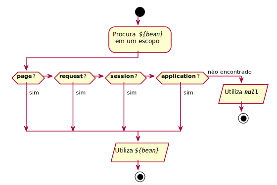

* TOC
{:toc}

# Introdução

Quando instanciamos um bean dentro de um JSP, podemos definir um escopo para a variável.

Fazemos isso usando o atributo `scope` da tag `<jsp:useBean>`.

{: data-caption="lado servidor"}
```html
<jsp:useBean id="pessoa" class="meupacote.Pessoa" scope="request"/>
```

No exemplo acima, instanciamos um JavaBeans em uma variável `pessoa` alocada no escopo `request`.

Isto quer dizer que a variável estará disponível até o final da requisição atual. Na próxima requisição,
uma nova variável será criada.

# Escopos

O atributo `scope` aceita um dos quatro valores a seguir:

- **page:** a instância do bean fica disponível apenas na página JSP em que foi declarado.
- **request:** muito parecido com o escopo da página, mas com uma diferença sutil, o bean pode ser acessado por
  outros servlets ou páginas JSP que participarem da requisição.
- **session:** nesse escopo o bean será instanciado dentro da sessão do usuário e estará disponível enquanto a sessão existir.
- **application:** a variável do bean irá persistir até que a aplicação seja reiniciada ou reimplantada.

# Busca e inicialização

Quando utilizamos a tag `<jsp:useBean>`, primeiro é feito uma busca se já existe um bean com o _id_ especificado
naquele escopo, para depois iniciar uma nova instância.

Assim, se tivermos duas páginas JSP usando beans no escopo da aplicação, conforme exemplos a seguir, então o
atributo `frodo` será iniciado apenas na primeira vez que uma das páginas ser acessada pelo usuário.

{: data-caption="condado.jsp"}
```html
<jsp:useBean id="frodo" class="meupacote.Pessoa" scope="application"/>
```

{: data-caption="mordor.jsp"}
```html
<jsp:useBean id="frodo" class="meupacote.Pessoa" scope="application"/>
```

## Quando escopo não é definido

Usando a tag `<jsp:useBean>` sem definir um escopo, há um tipo de busca especial por todos os escopos na
sequência `page` → `request` → `session` → `application`.

Se nenhum bean for encontrado, ele é inicializado no escopo da página. 

## Algoritmo de busca e inicialização

Com a chamada `<jsp:useBean>` sem escopo

```html
<jsp:useBean id="pessoa" class="meupacote.Pessoa"/>
```

ocorre o algoritmo ilustrado no fluxograma abaixo.

{: width="80%"}

# Leitura Recomendada

**Capítulo 13**

{:width="200"}
