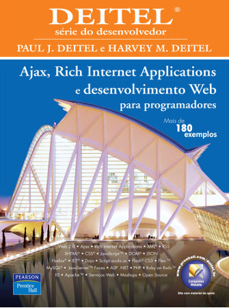

## Objetivos da aula

- Apresentar o Plano de Ensino
- Conhecer os alunos
- Explicar o valor da participação
- Pré-avaliação de conhecimento

## Avaliação

- (3,0) Participação
    - Pontualidade (até 20 minutos)
    - Atividades em sala
    - Trabalhos (apresentações)
- (7,0) Prova Escrita + Prática

## Faltas

- Máximo de 25% (15 faltas)
- Levará falta <u>quem não estiver presente</u> por no mínimo 40 minutos!

## O que você sabe?

Antes de iniciar, o aluno deve responder o questionário disponível em
[{{ 'teste-conhecimento-previo.html' | absolute_url }}](teste-conhecimento-previo.html).

Essas questões devem ser respondidas com <u>honestidade</u>, o aluno só tem a perder ao trapacear!

## O que espera-se que você aprenda?

- Como a web funciona.
- Construir aplicativos web utilizando Java.
    - Programação web tradicional
    - Programação web AJAX.
- Utilizar o padrão de projeto MVC.
- Separar o lado cliente do lado servidor.

## Planejamento das unidades

### Unidade 1

- Conceitos fundamentais de programação web
- Introdução à programação web com Java
- O estado da aplicação
- Separação lógica do código-fonte
- O padrão de projeto MVC

### Unidade 2

- Introdução ao framework Spring
- Definição da camada de persistência dos dados
- Objetos de acesso a dados
- Programação AJAX

### Unidade 3

- Autenticação e Autorização
- Projeto individual

## 👨‍🏫 Sobre o professor

- Colaborador de projetos open source
- Mestre em Ciência da Computação pela UFS
- Graduado e especializado pela Fanese

### Contato

- E-mail: <wagnermacedo@prof.fanese.edu.br>
- Telegram: [@wagnermacedo](https://t.me/wagnermacedo)

## 📚 Referências disponíveis na biblioteca

{: .references }
- 
- 
- 
- 

## 💻 Referências de sites

{: .references }
- Mozilla Developer Network <https://developer.mozilla.org/>
- Caelum <https://www.caelum.com.br/>
- W3Schools <https://www.w3schools.com/>
- jQuery API Documentation <http://api.jquery.com/>
- Manual de jQuery <http://www.criarweb.com/manual-jquery/>
