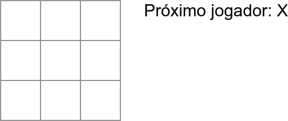
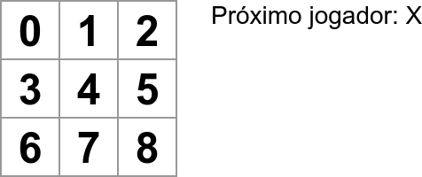

* TOC
{:toc .no-h3 data-caption="(em construção)"}

## Antes de iniciar, o que estamos construindo?

Vamos construir um jogo da velha interativo utilizando a tecnologia Java para web.

## Crie um projeto de aplicação web pelo NetBeans

Veja como fazer isso em <https://netbeans.org/kb/docs/web/quickstart-webapps_pt_BR.html>.

Escreva "<u>jogo-da-velha</u>" para o nome do projeto.

## Prepare o código inicial

1. Remova o arquivo `web/index.html`
2. Adicione um arquivo `game.css` em `web/` com [este código CSS][game.css].
3. Adicione um arquivo `index.jsp` em `web/` com [este código JSP][index.jsp].
4. Crie uma pasta chamada `tags` em `web/WEB-INF/`
5. Adicione um arquivo `Game.tag` em `web/WEB-INF/tags/` com [este código][Game.tag].
6. Adicione um arquivo `Board.tag` em `web/WEB-INF/tags/` com [este código][Board.tag].
7. Adicione um arquivo `Square.tag` em `web/WEB-INF/tags/` com [este código][Square.tag].

[game.css]: https://raw.githubusercontent.com/wagnerluis1982/java-web-tutorial/07432f43a5b26b6b28ed879447173cb73aa432bf/web/game.css
[index.jsp]: https://raw.githubusercontent.com/wagnerluis1982/java-web-tutorial/07432f43a5b26b6b28ed879447173cb73aa432bf/web/index.jsp
[Game.tag]: https://raw.githubusercontent.com/wagnerluis1982/java-web-tutorial/07432f43a5b26b6b28ed879447173cb73aa432bf/web/WEB-INF/tags/Game.tag
[Board.tag]: https://raw.githubusercontent.com/wagnerluis1982/java-web-tutorial/07432f43a5b26b6b28ed879447173cb73aa432bf/web/WEB-INF/tags/Board.tag
[Square.tag]: https://raw.githubusercontent.com/wagnerluis1982/java-web-tutorial/07432f43a5b26b6b28ed879447173cb73aa432bf/web/WEB-INF/tags/Square.tag

## Começando

O código inicial contém a estrutura do que estamos construindo. Já contém os estilos de CSS, portanto só precisamos nos
preocupar com o Java.

Temos três arquivos com a extensão `.tag` dentro da pasta `web/WEB-INF/tags/`. Estes são como um JSP, mas funcionam como
componentes, do lado servidor, que podem ser reutilizados:

- Square renderiza um simples `<button>`, representando cada quadrado do jogo.
- Board renderiza nove quadrados, representando o tabuleiro do jogo.
- Game renderiza o tabuleiro e as informações do jogo.

Nesse ponto, a interface ainda não está interativa.

## Inicie a aplicação

Execute a aplicação no servidor e veja como está sendo renderizado no browser. Verifique o código fonte da página e
perceba que não aparece `<t:Board/>` ou `<t:Square/>`, isso ocorre porque essas tags são processadas pelo servidor antes
de enviar para o cliente.

## Utilizando o atributo do quadrado

Vamos utilizar o atributo `value` em `Square.tag` para exibir o valor recebido. Faça isso, substituindo o
`<!-- A FAZER -->` por `${value}`.

{: data-hi="3" data-caption="Square.tag" }
```
<%-- O conteúdo é especificado aqui --%>
<button class="square">
    ${value}
 </button>
```

---

Antes:

{:.center}


Depois: você deverá ver um número em cada quadrado na saída renderizada.

{:.center}


## Adicionando interatividade

Vamos fazer cada quadrado ser preenchido com um "X" quando clicar nele.

### Recebendo o clique do usuário

Precisamos saber qual quadrado foi clicado. Isso é uma entrada do usuário enviado ao servidor.
Para coletar entradas do usuário, usamos a tag HTML `<form>`.

Mas primeiramente, vamos nomear o parâmetro enviado ao servidor, modificando `Square.tag`.

{: data-hi="2" data-caption="Square.tag" }
```
<%-- O conteúdo é especificado aqui --%>
<button class="square" name="square" value="${value}">
    ${value}
</button>
```

E vamos envolver todos os `<button>` em um formulário web.

{: data-hi="2,20" data-caption="Board.tag" }
```
<%-- O conteúdo é especificado aqui --%>
<form>
<div>
    <div class="board-row">
        <t:Square value="0" />
        <t:Square value="1" />
        <t:Square value="2" />
    </div>
    <div class="board-row">
        <t:Square value="3" />
        <t:Square value="4" />
        <t:Square value="5" />
    </div>
    <div class="board-row">
        <t:Square value="6" />
        <t:Square value="7" />
        <t:Square value="8" />
    </div>
</div>
</form>
```

### Mantendo o estado do tabuleiro

Agora, toda a vez que o usuário clicar em um quadrado, a posição do quadrado será enviado ao servidor. Você pode notar
que a URL do navegador modifica, adicionando `?square=0`, por exemplo.

O servidor recebe o parâmetro, mas não faz nada. Modifique `Game.tag` para adicionar uma ação quando o quadrado for clicado.
Esse código irá manter o estado do tabuleiro no servidor, dentro da sessão do usuário.

{: data-hi="4-10" data-caption="Game.tag" }
```
<%@taglib prefix="c" uri="http://java.sun.com/jsp/jstl/core" %>
<%@taglib prefix="t" tagdir="/WEB-INF/tags" %>

<%-- Variável da sessão requerida --%>
<jsp:useBean id="gameSquares" class="java.util.HashMap" scope="session" />

<%-- Marca no quadrado clicado um X --%>
<c:if test="${param['square'] != null}">
    <c:set target="${gameSquares}" property="${param['square']}" value="X"/>
</c:if>

<%-- O conteúdo é especificado aqui --%>
<c:set var="status" value="Próximo jogador: X" />
```

Para que o `<button>` reflita o estado do tabuleiro, modifique o arquivo `Square.tag`.

{: data-hi="3" data-caption="Square.tag" }
```
<%-- O conteúdo é especificado aqui --%>
<button class="square" name="square" value="${value}">
    ${gameSquares[value]}
</button>
```

## Separação lógica do código

O arquivo JSP deveria estar codificado apenas com informações da interface do usuário, pois (1) o responsável por esses
arquivos não precisa ser um especialista em Java, (2) ele não precisa saber qual a estrutura de dados sendo usada para
gravar os dados e (3) nem mesmo qual o nome do parâmetro do usuário utilizado.

Essas são tarefas de programação e, para isso, usaremos uma classe Java com o código necessário chamado Servlet.

### Adicione um Servlet

Crie uma classe Java chamada `GameServlet` dentro do pacote `tictactoe.web` com [este código][GameServlet].

[GameServlet]: https://raw.githubusercontent.com/wagnerluis1982/java-web-tutorial/7935250b30ad2fadfb892e9a4bf8cd8e11f6956d/src/java/tictactoe/web/GameServlet.java

Esta classe deve herdar de `HttpServlet` e permite receber requisições do lado cliente pela anotação

```
@WebServlet(urlPatterns = {"/play-game"})
```

O `GameServlet`, por exemplo, será acessível por <code>http://localhost:8080/jogo-da-velha<b>/play-game</b></code>.

### Utilize o caminho absoluto nos arquivos estáticos

Se o `GameServlet` fosse mapeado para um caminho mais profundo, por exemplo, `/jogos/velha`, o arquivo CSS usado em
`index.jsp` não seria encontrado. Vamos mudar isso usando um `<c:url/>`.

{: data-hi="6" data-caption="index.jsp" }
```
<!DOCTYPE html>
<html>
    <head>
        <meta charset="utf-8">
        <title>Jogo da Velha</title>
        <link rel="stylesheet" href="<c:url value="/game.css"/>" />
    </head>
```

### Mova a lógica do clique para o Servlet

Remova do arquivo `Game.tag` as tags `<jsp:useBean/>` e `<c:if/>`.

{: data-hi="1-3" data-caption="Game.tag" }
```
<%@taglib prefix="c" uri="http://java.sun.com/jsp/jstl/core" %>
<%@taglib prefix="t" tagdir="/WEB-INF/tags" %>

<%-- O conteúdo é especificado aqui --%>
<c:set var="status" value="Próximo jogador: X" />
```

E na classe `GameServlet`, modifique o método `doGet()` para ficar com o seguinte código.

{: data-hi="8-22" data-caption="GameServlet.java" }
```
@WebServlet(urlPatterns = {"/play-game"})
public class GameServlet extends HttpServlet {

    @Override
    protected void doGet(HttpServletRequest request, HttpServletResponse response) throws ServletException, IOException {
        // A sessão atual do usuário
        HttpSession session = request.getSession();

        // Tenta pegar a variável da sessão
        Map squares = (Map) session.getAttribute("gameSquares");

        // Se a variável não existir, cria uma nova
        if (squares == null) {
            session.setAttribute("gameSquares", squares = new HashMap());
        }

        // Marca o quadrado clicado com um X
        String paramSquare = request.getParameter("square");
        if (paramSquare != null) {
            squares.put(paramSquare, 'X');
        }

        // Passa a requisição para outro componente
        RequestDispatcher jsp = request.getRequestDispatcher("/index.jsp");
        jsp.forward(request, response);
    }

}
```

### Configurando um único ponto de entrada

Quando você reiniciar o servidor, a sessão estará limpa, de modo que quando o usuário acessar diretamente o `index.jsp`,
a variável da sessão `${gameSquares}` não vai existir. O jogo só irá funcionar se acessado pela URL `/play-game`!

Assim, vamos fazer `/play-game` como o único ponto de entrada, fazendo primeiramente o seguinte:

1. Crie uma pasta chamada `jsp` em `web/WEB-INF/`
2. Mova o arquivo `index.jsp` para `web/WEB-INF/jsp/` com o nome de `game.jsp`

Isso irá esconder o arquivo JSP, pois o usuário não pode acessar qualquer coisa que eseteja dentro da pasta `WEB-INF`.

O segundo passo é alterar o `GameServlet` para fazer o `forward` para o JSP correto:

{: data-hi="2" data-caption="GameServlet.java" }
```
        // Passa a requisição para outro componente
        RequestDispatcher jsp = request.getRequestDispatcher("/WEB-INF/jsp/game.jsp");
        jsp.forward(request, response);
```

### Configure a raiz da aplicação

Este é um passo opcional, mas muito útil.

Como não existe mais um arquivo `index.jsp` em `web/`, o usuário vai receber um código 404 quando tentar acessar a
aplicação em `http://localhost:8080/jogo-da-velha/`.

Vamos resolver isso, crie um novo arquivo `index.jsp` com o seguinte conteúdo:

{: data-caption="index.jsp (novo)" }
```
<jsp:forward page="/play-game" />
```




## Uma estrutura de dados mais adequada

O tipo `Map` é genérico demais para armazenar o tabuleiro. De forma a utilizar melhor os recursos do servidor, vamos
modificar o tipo da variável da sessão `gameSquares` para um array de caracteres.

{: data-hi="6,10,16-17" data-caption="GameServlet.java" }
```
    protected void doGet(HttpServletRequest request, HttpServletResponse response) throws ServletException, IOException {
        // A sessão atual do usuário
        HttpSession session = request.getSession();

        // Tenta pegar a variável da sessão
        Character[] squares = (Character[]) session.getAttribute("gameSquares");

        // Se a variável não existir, cria uma nova
        if (squares == null) {
            session.setAttribute("gameSquares", squares = new Character[9]);
        }

        // Marca o quadrado clicado com um X
        String paramSquare = request.getParameter("square");
        if (paramSquare != null) {
            int index = Integer.parseInt(paramSquare);
            squares[index] = 'X';
        }

        // Passa a requisição para outro componente
        RequestDispatcher jsp = request.getRequestDispatcher("/WEB-INF/jsp/game.jsp");
        jsp.forward(request, response);
    }
```

## Modificando uma cópia do tabuleiro

Como o servidor web pode atender a milhares de requisições ao mesmo tempo, é uma boa ideia considerar as variáveis
compartilhadas imutáveis, ou seja, trabalhar com cópias dessas variáveis em vez de modificá-las diretamente.

Modifique mais uma vez `GameServlet` para satisfazer essa necessidade:

{: data-hi="17-20" data-caption="GameServlet.java" }
```
    protected void doGet(HttpServletRequest request, HttpServletResponse response) throws ServletException, IOException {
        // A sessão atual do usuário
        HttpSession session = request.getSession();

        // Tenta pegar a variável da sessão
        Character[] squares = (Character[]) session.getAttribute("gameSquares");

        // Se a variável não existir, cria uma nova
        if (squares == null) {
            session.setAttribute("gameSquares", squares = new Character[9]);
        }

        // Marca o quadrado clicado com um X
        String paramSquare = request.getParameter("square");
        if (paramSquare != null) {
            int index = Integer.parseInt(paramSquare);
            // Modifica uma cópia do array e o coloca na sessão, no lugar do anterior.
            Character[] squaresCopy = squares.clone();
            squaresCopy[index] = 'X';
            session.setAttribute("gameSquares", squaresCopy);
        }

        // Passa a requisição para outro componente
        RequestDispatcher jsp = request.getRequestDispatcher("/WEB-INF/jsp/game.jsp");
        jsp.forward(request, response);
    }
```

### Sobre a imutabilidade 

Um problema comum na programação web é a concorrência. Como o servidor web pode atender a milhares de requisições ao
mesmo tempo, se um dado compartilhado for modificado ao mesmo tempo, sérias corrupções dos dados podem ocorrer.

Existe mais de uma forma de contornar esse problema, uma delas é trabalhar sempre com cópias. Para entender melhor essas
questões, faça uma pesquisa sobre _threads_.

### Dois grandes benefícios da imutabilidade

Trabalhar com objetos imutáveis também traz outros benefícios:

- Maior facilidade em implementar desfazer/refazer e funções de máquina do tempo.
- Rastrear mudanças é mais fácil, pois não é preciso fazer comparações. 

## Maior organização do código

Vamos separar ainda mais o código, criando uma classe `GameApp` para gerenciar o jogo. A princípio, essa classe só
mantém um atributo `squares`, que é o array de caracteres que representa o tabuleiro.

Crie a classe `GameApp` dentro do pacote `tictactoe.web` com o seguinte código:

{: data-caption="GameApp.java (novo)"}
```
package tictactoe.web;

public class GameApp {

    private Character[] squares = new Character[9];

    public void clickSquare(int index) {
        // Modifica uma cópia do array
        Character[] squares = this.squares.clone();
        squares[index] = 'X';

        // Atualiza o estado do jogo
        this.squares = squares;
    }

    public Character[] getSquares() {
        return this.squares;
    }

}
```

Faça as modificações indicadas no código a seguir em `GameServlet`. Eis um breve sumário das modificações efetuadas:

1. Altera o tipo da variável de sessão para `GameApp`.
2. Altera o nome dessa variável para apenas `"game"`.
3. Adiciona um método privado chamado `getGame(HttpServletRequest)` com o código de obter ou criar a variável da sessão.
4. Chama o método `clickSquare(int)` da classe `GameApp` para marcar o "X" do tabuleiro.


{: data-hi="6-8,13,21-34" data-caption="GameServlet.java" }
```
@WebServlet(urlPatterns = {"/play-game"})
public class GameServlet extends HttpServlet {

    @Override
    protected void doGet(HttpServletRequest request, HttpServletResponse response) throws ServletException, IOException {
        // O jogo do usuário atual
        GameApp game = getGame(request);
        
        // Marca o quadrado clicado com um X
        String paramSquare = request.getParameter("square");
        if (paramSquare != null) {
            int index = Integer.parseInt(paramSquare);
            game.clickSquare(index)
        }

        // Passa a requisição para outro componente
        RequestDispatcher jsp = request.getRequestDispatcher("/WEB-INF/jsp/game.jsp");
        jsp.forward(request, response);
    }

    private static GameApp getGame(HttpServletRequest request) {
        // A sessão atual do usuário
        HttpSession session = request.getSession();

        // Tenta pegar a variável da sessão
        GameApp game = (GameApp) session.getAttribute("game");

        // Se a variável não existir, cria uma nova
        if (game == null) {
            session.setAttribute("game", game = new GameApp());
        }

        return game;
    }

}
```

Por último, renomeie o nome da variável em `Square.tag` para poder encontrar o tabuleiro:

{: data-hi="3" data-caption="Square.tag" }
```
<%-- O conteúdo é especificado aqui --%>
<button class="square" name="square" value="${value}">
    ${game.squares[value]}
</button>
```

### Um pequeno refinamento

Crie em `GameApp` um método `clickSquare(String)` para reduzir a complexidade do servlet.

Faça as seguintes modificações em `GameApp` e `GameServlet`:

{: data-hi="5-11" data-caption="GameApp.java"}
```
public class GameApp {

    private Character[] squares = new Character[9];

    public void clickSquare(String param) {
        if (param != null) {
            int index = Integer.parseInt(param);
            clickSquare(index);
        }
    }

    public void clickSquare(int index) {
        // Modifica uma cópia do array
        Character[] squares = this.squares.clone();
        squares[index] = 'X';

        // Atualiza o estado do jogo
        this.squares = squares;
    }

    public Character[] getSquares() {
        return this.squares;
    }

}
```

{: data-hi="7" data-caption="GameServlet.java" }
```
    protected void doGet(HttpServletRequest request, HttpServletResponse response) throws ServletException, IOException {
        // O jogo do usuário atual
        GameApp game = getGame(request);

        // Marca o quadrado clicado com um X
        String paramSquare = request.getParameter("square");
        game.clickSquare(paramSquare);

        // Passa a requisição para outro componente
        RequestDispatcher jsp = request.getRequestDispatcher("/WEB-INF/jsp/game.jsp");
        jsp.forward(request, response);
    }
```

## Adicionando turnos

Um defeito óbvio do jogo é que somente X pode jogar. Vamos corrigir isso.

Vamos fazer o primeiro movimento ser de 'X'. Adicione uma nova propriedade à `GameApp`:

{: data-hi="4" data-caption="GameApp.java"}
```
public class GameApp {

    private Character[] squares = new Character[9];
    private char turn = 'X';

```

Lembre-se de adicionar um método _get_ para `turn`:

```
    public char getTurn() {
        return this.turn;
    }
```

A cada movimento, vamos alternar a propriedade `turn` entre os valores 'X' e 'O'. Atualize o método `clickSquare(int)`
da classe `GameApp` para alternar o valor de `turn`:

{: data-hi="4,8" data-caption="GameApp.java"}
```
    public void clickSquare(int index) {
        // Modifica uma cópia do array
        Character[] squares = this.squares.clone();
        squares[index] = this.turn;

        // Atualiza o estado do jogo
        this.squares = squares;
        this.turn = (this.turn == 'X') ? 'O' : 'X';
    }
```

Agora modifique `Game.tag` para usar `${game.turn}`. Assim o usuário saberá de quem é a rodada.

{: data-hi="2" data-caption="Game.tag" }
```
<%-- O conteúdo é especificado aqui --%>
<c:set var="status" value="Próximo jogador: ${game.turn}" />

<div class="game">
    <div class="game-board">
```

## Declarando um vencedor

Vamos mostrar quando um jogo foi ganho. Adicione o seguinte método auxiliar ao final de `GameApp`: 

```
    private static char calculateWinner(Character[] squares) {
        // Posições que se marcadas, significa vitória
        int[][] lines = new int[][]{
            {0, 1, 2},
            {3, 4, 5},
            {6, 7, 8},
            {0, 3, 6},
            {1, 4, 7},
            {2, 5, 8},
            {0, 4, 8},
            {2, 4, 6},
        };

        // Processa o tabuleiro para identificar um vencedor
        for (int[] line : lines) {
            int a = line[0],
                b = line[1],
                c = line[2];
            if (squares[a] != null && squares[a] == squares[b] && squares[a] == squares[c]) {
                return squares[a];
            }
        }

        // Ainda sem um vencedor
        return ' ';
    }
```

Adicione uma nova propriedade `winner` à classe `GameApp`. Essa propriedade poderá ter três valores:

- `' '` (espaço em branco) indica que o jogo ainda não tem vencedor.
- `'X'` indica que X é o vencedor.
- `'O'` indica que O é o vencedor.

{: data-hi="5" data-caption="GameApp.java"}
```
public class GameApp {

    private Character[] squares = new Character[9];
    private char turn = 'X';
    private char winner = ' ';

```

Também adicione um método _get_ para `winner`:

```
    public char getWinner() {
        return this.winner;
    }
```

Agora vamos modificar o método `clickSquare` para calcular o vencedor usando o método auxiliar:

{: data-hi="2-5,14" data-caption="GameApp.java"}
```
    public void clickSquare(int index) {
        // Parando se já tiver um vencedor ou o quadrado já estiver clicado
        if (this.winner != ' ' || this.squares[index] != null) {
            return;
        }

        // Modifica uma cópia do array
        Character[] squares = this.squares.clone();
        squares[index] = this.turn;

        // Atualiza o estado do jogo
        this.squares = squares;
        this.turn = (this.turn == 'X') ? 'O' : 'X';
        this.winner = calculateWinner(squares);
    }
```

Para mostrar o vencedor, modifique `Game.tag` para definir a mensagem de status correta.

{: data-hi="2-9" data-caption="Game.tag" }
```
<%-- O conteúdo é especificado aqui --%>
<c:choose>
    <c:when test="${game.winner == ' '}">
        <c:set var="status" value="Próximo jogador: ${game.turn}" />
    </c:when>
    <c:otherwise>
        <c:set var="status" value="Vencedor: ${game.winner}" />
    </c:otherwise>
</c:choose>

<div class="game">
    <div class="game-board">
```

## Fazendo uso de JavaScript para otimizar

Quando um quadrado já está marcado ou o jogo já tem um vencedor, não faz mais sentido que o clique gere uma nova
requisição ao servidor.

Lembre-se que pode haver milhares de requisições ao mesmo tempo, assim é muito interessante que o navegador só envie
requisições para o servidor se realmente <u>necessário</u>.

### Configurando para usar jQuery

Vamos utilizar jQuery, uma biblioteca JavaScript, para termos um código JS mais simples.

Adicione ao arquivo `web/WEB-INF/jsp/game.jsp` a seguinte tag `<script>`:

{: data-hi="7" data-caption="WEB-INF/jsp/game.jsp" }
```
<!DOCTYPE html>
<html>
    <head>
        <meta charset="utf-8">
        <title>Jogo da Velha</title>
        <link rel="stylesheet" href="<c:url value="/game.css"/>" />
        <script src="http://code.jquery.com/jquery-3.3.1.min.js"></script>
    </head>
```

### Impedindo o envio de quadrado já marcado

Crie o arquivo JavaScript `web/game.js` (não crie dentro de `WEB-INF/`) com o seguinte conteúdo:

{: data-caption="game.js (novo)" }
```
// Não submete o formulário se o quadrado clicado já estiver marcado
$('.square').click(function (event) {
    if (this.innerText) {
        event.preventDefault();
    }
});
```

Agora faça uso desse arquivo, adicionando a seguinte tag `<script>` no final de `<body>`:

{: data-hi="3" data-caption="WEB-INF/jsp/game.jsp" }
```
    <body>
        <t:Game />
        <script src="<c:url value="/game.js"/>"></script>
    </body>
</html>
```

## Impedindo o envio em jogo com vencedor

Para o quadrado marcado, usamos como referência o valor do `innerText` dos elementos `<button>`. Já para o
jogo terminado, utilizaremos outra abordagem.

Vamos adicionar um novo atributo HTML à tag `<form>` chamado `data-finished`, onde:

1. Se `<form data-finished="false">` ou não tiver o atributo, o clique estará habilitado.
2. Se `<form data-finished="true">`, jogo encerrado, qualquer clique estará desabilitado.

Modifique o arquivo `Board.tag` para receber o atributo `${finished}` e preencher o atributo HTML.

{: data-hi="3-4,10" data-caption="Board.tag" }
```
<%@tag description="O tabuleiro do jogo" pageEncoding="UTF-8" trimDirectiveWhitespaces="true"%>

<%-- A lista de atributos dessa tag --%>
<%@attribute name="finished" %>

<%-- Outras tags requeridas para funcionar --%>
<%@taglib prefix="t" tagdir="/WEB-INF/tags" %>

<%-- O conteúdo é especificado aqui --%>
<form data-finished="${finished}">
<div>
    <div class="board-row">
        <t:Square value="0" />
        <t:Square value="1" />
        <t:Square value="2" />
    </div>
```

Em seguida, modifique `Game.tag` para indicar se o jogo está terminado (`finished`) em `<t:Board/>`:

{: data-hi="3" data-caption="Game.tag" }
```
<div class="game">
    <div class="game-board">
        <t:Board finished="${game.winner != ' '}" />
    </div>
    <div class="game-info">
        <div>${status}</div>
        <ol><!-- A FAZER --></ol>
    </div>
</div>
```

Se executar a aplicação e olhar o código-fonte no browser, irá perceber que o atributo `data-finished` receberá `true`
quando houver um ganhador, mas ainda não estará bloqueando cliques em quadrados vazios. Para isso, adicione ao arquivo
JavaScript `game.js` o seguinte código:

{: data-hi="8-11" data-caption="game.js" }
```
// Não submete o formulário se o quadrado clicado já estiver marcado
$('.square').click(function (event) {
    if (this.innerText) {
        event.preventDefault();
    }
});

// Não submete o formulário se já houver um vencedor
$('form[data-finished="true"]').submit(function (event) {
    event.preventDefault();
});
```




## Descritor de implantação

Um descritor de implantação é um arquivo XML que centraliza algumas configurações da aplicação. É opcional, mas útil
para algumas situações. Vamos criar um para esse projeto, embora não terá nenhum uso no momento.

1. Selecione Arquivo &gt; Novo Arquivo (Ctrl-N) no menu principal. Em Categorias, selecione Web, em Tipos de Arquivos,
   selecione Descritor de Implantação Padrão (web.xml) e clique em Próximo.
2. Na etapa 2, clique em Finalizar.

### A pasta WEB-INF

Observe que o descritor foi criado na pasta `WEB-INF` que fica na área de Páginas Web, esta é uma pasta especial que o
servidor não permite o acesso pelo lado cliente.

Como os arquivos `.tag` também estão nessa pasta, eles também não são acessíveis diretamente pelos visitantes.

## Objetivos dessa interação

### 1
- O ambiente de desenvolvimento 
- O que é um arquivo JSP? 
- Diferença entre HTML e JSP 
- O lado servidor 
### 2
- Formulário web 
- Estado da aplicação
### 3
- O que é um Servlet? 
- Mapeamento de URL 
- Cuidados com o caminho relativo 
### 4
- Forward vs Redirect 
- Separando a lógica da aplicação 
### 5
- Checagens no lado servidor 
- Removendo a lógica da aplicação do Servlet 
- Padrão MVC 
### 6
- Reduzindo a carga do servidor com JavaScript 
- Importância de manter a checagem do lado servidor 
### 7
- Método GET 
- Método POST 
- Quando usar GET ou POST 
### 8
- Debug de uma aplicação web 
### 9
- Entendendo melhor forward e redirect 
- Cuidados com o caminho absoluto 
### 10
- Entendendo a sessão web 
- Parâmetros da URL 
- Cookies e seus usos

