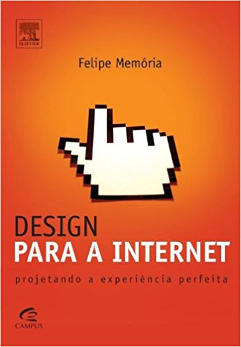
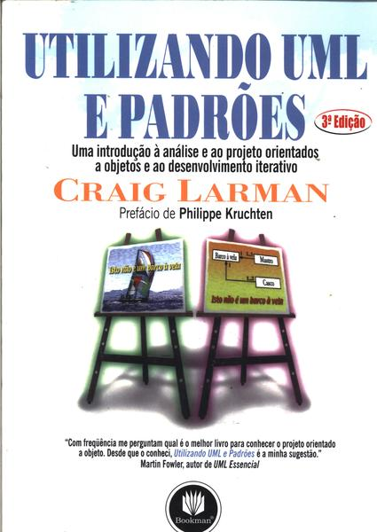
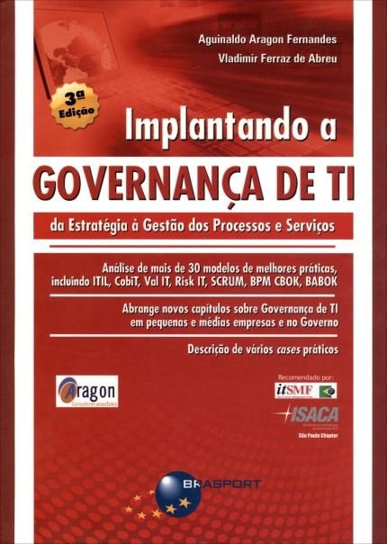
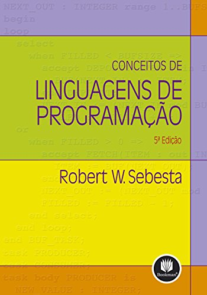

## Objetivos da aula

- Apresentar o Plano de Ensino
- Conhecer os alunos
- Explicar o valor da participação

## Avaliação

- (3,0) Participação
    - Pontualidade (até 20 minutos)
    - Atividades em sala
    - Trabalhos (apresentações)
- (7,0) Prova Escrita e/ou Prática

## Faltas

- Máximo de 25% (10 faltas)
- Levará falta <u>quem não estiver presente</u> por no mínimo 40 minutos!

## O que espera-se que você aprenda?

- Práticas de garantia da qualidade de software.
- Avaliar riscos de segurança em aplicações web.
- Aplicação de técnicas de teste de software.
- Importância do teste de software durante o desenvolvimento.

## Planejamento das unidades

### Unidade 1

- Garantia de Qualidade de Software

### Unidade 2

- Riscos de segurança em aplicações web

### Unidade 3

- Testes de software

## 👨‍🏫 Sobre o professor

- Colaborador de projetos open source
- Mestre em Ciência da Computação pela UFS
- Graduado e especializado pela Fanese

### Contato

- E-mail: <wagnermacedo@prof.fanese.edu.br>
- Telegram: [@wagnermacedo](https://t.me/wagnermacedo)

## 💻 Referências de sites

{: .references }
- OWASP -- Open Web Application Security Project <https://www.owasp.org/index.php/Main_Page>
- CWE -- Common Weakness Enumeration <https://cwe.mitre.org/>

## 📚 Referências disponíveis na biblioteca

{: .references }
- 
- 
- 
- 
- 
