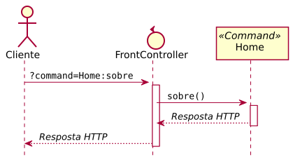

# Mini framework MVC

O framework é baseado em duas classes: `FrontController` e `Command`.


## Funcionamento básico

O seguinte diagrama de sequência mostra o funcionamento, sendo que o comando
solicitado é `Home` que possui um método chamado `sobre()`.

{: width="500px"}

## Definições das classes

{: data-caption="FrontController.java" }
```java

```

{: data-caption="Command.java" }
```java

```
